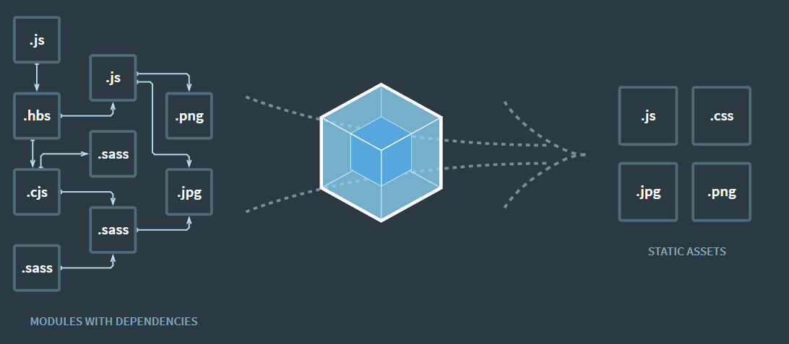
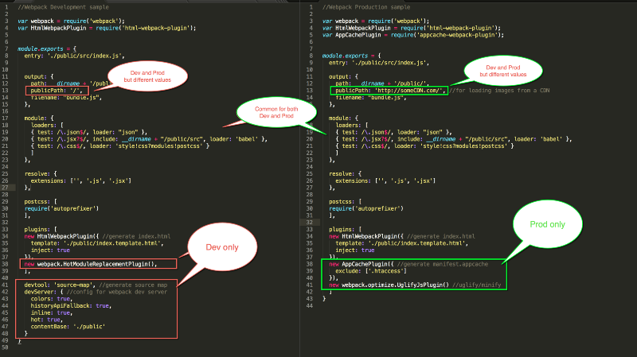
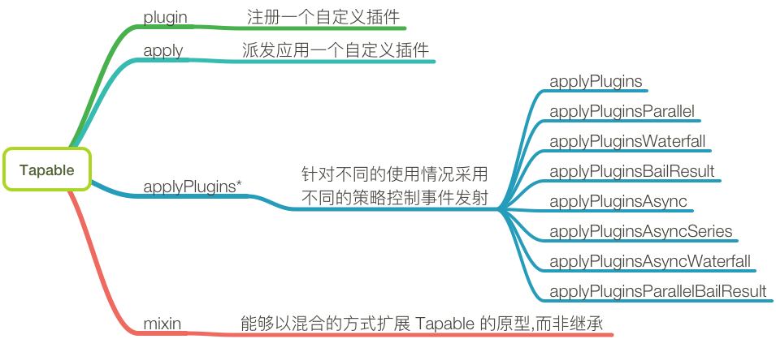
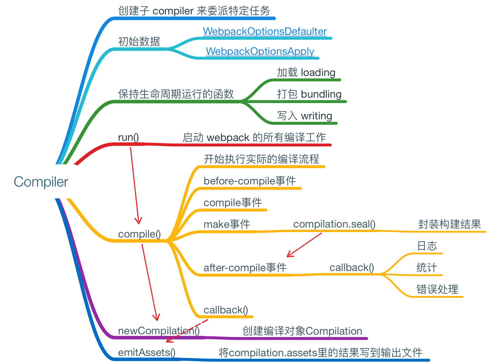

# Webpack 从入门到放弃

[GitHub地址](https://github.com/webpack/webpack)

[官方文档地址](https://webpack.js.org)

[中文文档地址](https://webpack.docschina.org)

## Webpack 是什么？为什么使用 webpack ？

Webpack，用官方的话来说就是：
> 本质上，webpack 是一个现代 JavaScript 应用程序的静态模块打包器(module bundler)。当 webpack 处理应用程序时，它会递归地构建一个依赖关系图(dependency graph)，其中包含应用程序需要的每个模块，然后将所有这些模块打包成一个或多个 bundle。

Webpack 有以下特点或者说优点：
- 运行在 node.js runtime
- 支持模块化，支持 AMD、CommonJs、UMD 模块化输出，方便旧项目代码迁移
- 高度可配置化，开箱即用，灵活性强，配置简单
- 扩展性强，插件完善，有庞大的社区支持
- 详细地开发文档（2.0之后）

## 核心概念
- Entry：入口，Webpack 执行构建的第一步将从 Entry 开始，可抽象成输入。
- Module：模块，在 Webpack 里一切皆模块，一个模块对应着一个文件。Webpack 会从配置的 Entry 开始递归找出所有依赖的模块。
- Chunk：代码块，一个 Chunk 由多个模块组合而成，用于代码合并与分割。
- Loader：模块转换器，用于把模块原内容按照需求转换成新内容。
- Plugin：扩展插件，在 Webpack 构建流程中的特定时机会广播出对应的事件，插件可以监听这些事件的发生，在特定时机做对应的事情。

## 常用配置项

    module.exports = {
        // 入口文件/
        entry: Object|Array|String,
        // 输出设置
        output: {
            // 输出路径
            path: string,
            // 输出文件名称
            filename: string,
            // 为动态加载的 Chunk 配置输出文件的名称
            chunkFilename: '[name].js', 
            // 以下均在输出库的情况下使用
            // 导出的 library 名称
            library: "math",
            // var （默认值）当 library 加载完成，入口起点的返回值将分配给一个变量
            // assign 这将产生一个隐含的全局变量，可能会潜在地重新分配到全局中已存在的值（谨慎使用）
            // this 入口起点的返回值将分配给 this 的一个属性
            // window 分配到 window 对象上
            // global 分配给 global 对象
            // commonjs|commonjs2 分配给 exports 对象
            // amd 暴露为 AMD 模块
            // umd 将你的 library 暴露为所有的模块定义下都可运行的方式。它将在 CommonJS, AMD 环境下运行，或将模块导出到 global 下的变量
            libraryTarget: "umd",
            // 设置导出模块
            libraryExport: "default"
        },
        resolve: {
            // 依赖项别名
            alias: {
                [key]: string
            }
        },
        module: {
            // 配置模块转换规则，即为某种类型的模块，
            // 设置相应的 loader 去解析
            rules: [
                {
                    // 正则表达式匹配文件名，一般是设置后缀名匹配
                    test: /\.xx$/,

                    // 设置 loader 由两种方式，使用 loader 或者 use，多个 
                    // loader 执行顺序从右往左，3.0 以后 loader 必须是全称
                    // 使用 loader 属性可传参，传参格式与 Get 请求一致，多个
                    // loader 之间使用 ! 连接
                    loader: "xx-loader!xx1-loader!xx2-loader?xx=&xx=",

                    // 使用 use 属性设置，格式是数组方式，成员可以为字符串和对象，
                    // 若是字符串代表 loader 名称
                    // 执行顺序同上
                    use: [
                        "xx-loader", 
                        {
                            loader: "xx-loader",
                            options: {}
                        }
                    ]
                }
            ]
        },
        // 挂载插件，插件一般都是构造函数形式，且构造函数
        // 参数为一个对象，为传递给插件的设置参数
        plugins: [
            new xxPlugin({
                ...
            })
        ],
        // 自 4.0 之后，大部分插件的设置都迁移到这个属性上
        optimization: {
            // 设置代码分割
            splitChunks: {},
            // 分离出 runtime 代码
            runtime: {}
        }
    };

## 打包原理

### 打包基本流程
1. 初始化阶段，读取合并配置参数，初始化 loader 与 plugin，实例化 compiler，compiler 调用 run 方法开始编译
2. 编译阶段，从入口文件出发，使用相应的 loader 解析内容，使 webpack 能够识别处理的有效模块，并递归进行编译处理，最后遍历完所有模块文件，生成 “模块依赖图” 
3. 输出阶段，根据模块生成 chunk，把 chunk 写入文件，存入文件系统或者内存文件系统 

### 模块管理
#### runtime
>在浏览器运行时，webpack 用来连接模块化的应用程序的所有代码。runtime包括：在模块交互时，连接模块所需的加载和解析逻辑。包括浏览器中的已加载模块的连接以及懒加载模块的执行逻辑。

#### mainfest
>当编译器开始执行、解析和映射应用程序时，它会保留所有模块的详细要点。这个数据集合称为“mainfest”，当完成打包并发送到浏览器时，会在运行时通过 mainfest 来解析和加载模块。

Webpack4 runtime 代码由 runtimeChunkPlugin 导出，
一般 webpack 导出的 runtime 文件代码结构大概是这样的：

    (function(modules) {
        // 已经加载的模块
        var installedModules = {};
        // 加载方法
        function __webpack_require__(moduleId) {
            ...
        }
    })({...};

runtime 里的模块管理主要由下面三个部分构成：

    // 所有模块的生成代码，
    var modules；
    // 所有已经加载的模块，作为缓存表
    var installedModules；
    // 加载模块的函数
    function webpack_require(moduleId);

webpack_require 的源码大概是这样：

    // 加载完毕的所有模块。
    var installedModules = {};
    
    function webpack_require(moduleId) {
        // 如果模块已经加载过了，直接从Cache中读取。
        if (installedModules[moduleId]) {
        return installedModules[moduleId].exports;
        }
    
        // 创建新模块并添加到installedModules。
        var module = installedModules[moduleId] = {
            id: moduleId,
            exports: {}
        };
    
        // 加载模块，即运行模块的生成代码，
        modules[moduleId].call(module.exports, module, module.exports, webpack_require);
    
        return module.exports;
    }

## 开发模式与生产模式
Webpack具有配置多样性，一些是在“开发模式”（development）下使用的，一些是“生产模式”下才能使用的，某些是共用的。举个栗子：

所以在配置前端工程化得时候，我们一般会把共用部分抽取出来，然后根据项目需求，把各个环境的配置分成一个文件，利用Mixins，与共用部分混合，组成完整的config文件。

## HMR
在开发阶段，若经常修改某个源文件，导致服务器或者客户端需要重新重启或者刷新才能看到效果，这必然会耗费大量时间，HMR 就是为了解决这个问题而设立的。

>HMR会在webapp运行过程中动态增加，删除，添加模块，而无需重新加载页面。

### 原理
- 监听文件修改变化，通知 Compiler 重新编译
- Compiler 重新编译构建修改的一个或多个模块，通知 HMR服务器 进行更新
- HMR Server 通过 websocket 通知 HMR Runtime 需要更新
- HMR Runtime 替换更新中的模块

Webpack 向 client 暴露了一系列 HMR Runtime API，可以让客户端在 HMR 的某个时刻做一些有趣的事情。

### 开箱即用的Webpack-dev-server
Webpack-dev-server 是一款开箱即用的 HMR 插件，且 Webpack 内部集成了 Webpack-dev-server 配置项，只要配置好 devServer，以及注入 webpack.HotModuleReplacementPlugin 插件即可使用。

    // Npm scripts
    webpack-dev-server --colors --progress

    // entry.js
    if (module.hot) {
        module.hot.accept("./xxx.js", function() {
            console.log("Accepting the updated printMe module!");
        })
    }

    // webpack.config.js
    module.exports = merge(baseConfig, {
        ...,
        devServer: {
            port: 3000,
            host: "localhost",
            contentBase: path.join(__dirname, "dest"),
            hot: true
        },
        plugins: [
            new webpack.HotModuleReplacementPlugin()
        ]
    });

### DevServer与后端服务器结合
当你有一个单独的 API 后端服务器，且想在同一域下调用这些 API，你就需要用到 proxy 属性。

    proxy: {
        '/proxy': {
            target: 'http://your_api_server.com',
            changeOrigin: true,
            pathRewrite: {
                '^/proxy': ''
            }
    }

### 集成node.js服务端
若是需要与node.js后端联合开发，且希望不想另外搭建一个静态页面服务器集成 HMR，对于这种情况，需要两个middleware，分别是 webpack-dev-middleware 与 webpack-hot-middleware。

Webpack-dev-middleware 在 webpack 模块依赖图基础上构建了一套内存文件的缓存系统，把负责将编译后的文件以内存方式存储在服务器中，因为是储存在内存中， 因此访问速度比硬盘读取快。Webpack-hot-middleware 则负责HMR服务器与客户端之间的热更新数据传递。

以 Express 为例，只要导入 Webpack-dev-middleware 与 Webpack-hot-middleware，并挂载在 Express 的实例上，服务端的配置基本完成，当然，两个中间件各有不同的参数，你可以翻阅官方文档进行查阅。而在 webpack 配置文件中，需要在 entry 上添加 "webpack-hot-middleware/client?xxx=xxx"，然后在 plugins 中注册 HotModuleReplacementPlugin即可。

## 代码分割与按需加载
Webpack4 版本把 CommonChunkPlugin 移除，用 SplitChunksPlugin 替代 CommonChunkPlugin。CommonChunkPlugin 会把公用模块全都抽取出来，造成入口文件过大，不利于首屏显示，SplitChunksPlugin就是在解决代码重复程度与入口文件大小之间的平衡而设的。

Webpack 会根据下述条件自动分割 chunks：
- 新代码块可以被共享引用，or 这些模块都是来自node_modules文件夹里面
- 新代码块大于30kb（min+gziped之前的体积）
- 按需加载的代码块，最大数量应该小于或者等于5
- 初始加载的代码块，最大数量应该小于或等于3
- 当试图满足最后两个条件，首选更大的块

SplitChunksPlugin选项：

    // 哪类型的块可以优化，默认为 all
    chunks: all,
    // 压缩前最小模块大小，默认0（bytes）
    minSize: 30000,
    // 表示代码分割前必须共享模块的最小块数量
    minChunks: 1,
    // 最大按需（异步）加载次数，默认为1
    maxAsyncRequests: 1,
    // 最大初始化加载次数，默认为1
    maxInitialRequests: 1,
    // 拆分出来块的名字，默认由块名和hash值自动生成
    name: [name] + [hash],
    // 模块最大大小，用于告诉 webpack 尝试将大于 maxSize的块拆分成更小的部分。Chunk 的尺寸最小为 minSize。
    maxSize,
    // 缓存组
    cacheGroups: {
        // 缓存组继承 splitChunks 的所有设置项，且可以覆盖原值
        [key]: {
            // 缓存组的匹配规则
            test,
            // 表示制作缓存组的优先级
            priority,
            // 表示可以使用已经存在的块，即如果满足条件的块已经存在就使用已有的，不再创建一个新的块
            reuseExistingChunk
        },
        ...
    }

按需加载伪代码：

    // Es6 标准，通过注释制定打包后的 chunk 名称
    import(/* webpackChunkName: 'chunk'*/"chunk").then(callback)

    // webpack 内部实现
    require.ensure(["chunk"], callback, chunkName)

## Tree shaking
当在一个模块文件中，引入了另一个模块，但是并没有使用被引入模块的内容时，webpack 依然会把没使用的那部分的代码编译进去，这样会对资源产生浪费，这个时候，若要优化这一方面，我们需要使用摇树（Tree shaking）。这思想最初出自 Rollup，利用 es6 的静态解析特性，在解析阶段就确定输出模块，可以确定哪些模块会被使用，只要在 AST 阶段把 dead code 移除，只剩下被使用部分，这样就能实现 tree-shaking。

## 自定义 Loader

    const loaderUtils = require("loader-utils");
    // source 为 compiler 传递给 Loader 的一个文件的原内容
    // 该函数需要返回处理后的内容，这里简单起见，直接把原内容返回了，相当于该 Loader 没有做任何转换
    module.exports = function(source){
        // 获取 options
        const options = loaderUtils.getOptions(this);
        ...
        // 关闭缓存功能
        // this.cacheable(false);
        // 使用 callback 多结果返回
        this.callback(
            // 当无法转换原内容时，给 Webpack 返回一个 Error
            err: Error | null,
            // 原内容转换后的内容
            content: string | Buffer,
            // 用于把转换后的内容得出原内容的 Source Map，方便调试
            sourceMap?: SourceMap,
            // 如果本次转换为原内容生成了 AST 语法树，可以把这个 AST 返回，
            // 以方便之后需要 AST 的 Loader 复用该 AST，以避免重复生成 AST，提升性能
            abstractSyntaxTree?: AST
        );
        // 只输出编译结果
        // return source;
    }

>Source Map 的生成很耗时，通常在开发环境下才会生成 Source Map，其它环境下不用生成，以加速构建。 为此 Webpack 为 Loader 提供了 this.sourceMap API 去告诉 Loader 当前构建环境下用户是否需要 Source Map。 如果你编写的 Loader 会生成 Source Map，请考虑到这点。

除了上述提到的能调用的 Webpack API 外，还有以下常用的 API：
- this.context：当前处理文件的所在目录，假如当前 Loader 处理的文件是 /src/main.js，则 this.context 就等于 /src。
- this.resource：当前处理文件的完整请求路径，包括 querystring，例如 /src/main.js?name=1。
- this.resourcePath：当前处理文件的路径，例如 /src/main.js。
- this.resourceQuery：当前处理文件的 querystring。
- this.target：等于 Webpack 配置中的 Target。
- this.loadModule：但 Loader 在处理一个文件时，如果依赖其它文件的处理结果才能得出当前文件的结果时， 就可以通过 
- this.loadModule(request: string, callback: function(err, source, sourceMap, module)) 去获得 request 对应文件的处理结果。
- this.resolve：像 require 语句一样获得指定文件的完整路径，使用方法为 resolve(context: string, request: string, callback: function(err, result: string))。
- this.addDependency：给当前处理文件添加其依赖的文件，以便再其依赖的文件发生变化时，会重新调用 Loader 处理该文件。使用方法为 addDependency(file: string)。
- this.addContextDependency：和 addDependency 类似，但 addContextDependency 是把整个目录加入到当前正在处理文件的依赖中。使用方法为 addContextDependency(directory: string)。
- this.clearDependencies：清除当前正在处理文件的所有依赖，使用方法为 clearDependencies()。
- this.emitFile：输出一个文件，使用方法为 emitFile(name: string, content: Buffer|string, sourceMap: {...})。

### 加载本地 Loader
#### Npm link
Npm link 专门用于开发和调试本地 Npm 模块，能做到在不发布模块的情况下，把本地的一个正在开发的模块的源码链接到项目的 node_modules 目录下，让项目可以直接使用本地的 Npm 模块。 由于是通过软链接的方式实现的，编辑了本地的 Npm 模块代码，在项目中也能使用到编辑后的代码。

步骤如下：
- 确保正在开发的本地 Npm 模块（也就是正在开发的 Loader）的 package.json 已经正确配置好；
- 在本地 Npm 模块根目录下执行 npm link，把本地模块注册到全局；
- 在项目根目录下执行 npm link loader-name，把第2步注册到全局的本地 Npm 模块链接到项目的 node_moduels 下，其中的 loader-name 是指在第1步中的 package.json 文件中配置的模块名称。

#### ResolveLoader
ResolveLoader 用于配置 Webpack 如何寻找 Loader。 默认情况下只会去 node_modules 目录下寻找，为了让 Webpack 加载放在本地项目中的 Loader 需要修改 resolveLoader.modules。

假如本地的 Loader 在项目目录中的 ./loaders/loader-name 中，则需要如下配置：

    module.exports = {
        resolveLoader:{
            // 去哪些目录下寻找 Loader，有先后顺序之分
            modules: ['node_modules','./loaders/'],
        }
    }

加上以上配置后， Webpack 会先去 node_modules 项目下寻找 Loader，如果找不到，会再去 ./loaders/ 目录下寻找。

## 插件机制

Webpack 基于事件流的插件架构，内部工作流程基于插件机制串接起来，而组织管理这一切的是 Tapable。Tapable 是一个用于事件发布订阅执行的插件架构，由官方维护。基于 Tapable 架构的 Webpack 体系保证了插件的有序性，使得整个系统非常有弹性，扩展性很好；然而有一个致命的缺点就是源码阅读性差、调试困难。

### Compiler
>Webpack 初始化时创建的单例对象，基于 Tapable 的实例，整个 webpack 生命周期里只有一个，包含了 webpack 的所有环境描述。

| 钩子 | 作用 | 参数 | 类型 |
| ------ | ------ | ------ | ------ |
| entry-option | 在 entry 配置项处理之后 | 无 | sync-bail |
| before-run | 在 compiler.run() 执行之前 | compiler | async |
| run | 在读取记录之前 | compiler | async |
| watch-run | 监听模式下，新的一次 compilation 触发之后，在编译开始之前  | compiler | async |
| before-compile | 在创建新 compilation 之后 | compilationParams | async |
| compile | 在创建新 compilation 之前 | compilationParams | sync |
| compilation | compilation 创建完成 | compilation | sync |
| make | 从 entry 开始递归分析依赖，对依赖模块执行 build | compilation | async |
| emit | 在生成资源并输出到目录之前 | compilation | async |
| after-emit | 在生成资源并输出到目录之后 | compilation | async |
| done | 完成编译 | stats | sync |

### Compilation
>Compilation 对象代表了一次单一的版本构建和生成资源，基于 Tapable 的实例。当运行 webpack 时，每当检测到一个文件变化，一次新的编译将被创建，从而生成一组新的编译资源。一个编译对象表现了当前的模块资源、编译生成资源、变化的文件、以及被跟踪依赖的状态信息。

>Compiler（编译器）的run方法中调用compiler方法开始编译，在编译过程中创建了一个Compilation对象。

>Compilation 实例能够访问所有的模块和它们的依赖（大部分是循环依赖）。它会对应用程序的依赖图中所有模块进行字面上的编译(literal compilation)。在编译阶段，模块会被加载(loaded)、封存(sealed)、优化(optimized)、分块(chunked)、哈希(hashed)和重新创建(restored)。

| 钩子 | 作用 | 参数 | 类型 |
| ------ | ------ | ------ | ------ |
| normal-module-loader | 普通模块加载 | loaderContext module | sync |
| seal | Compilation 停止接受新模块时触发 | 无 | sync |
| optimize-modules | 优化模块 | modules | sync-bail |
| optimize-chunks | 优化 Chunk | chunks | sync-bail | 
| optimize-chunk-assets | 优化所有 chunk 资源(asset)。资源(asset)会被存储在 compilation.assets。每个 Chunk 都有一个 files 属性，指向这个 chunk 创建的所有文件。附加资源(asset)被存储在 compilation.additionalChunkAssets 中 | chunks | async-series |
| optimize-assets | 优化存储在 compilation.assets 中的所有资源(asset) | assets | async-series |
| before-hash | 编译生成哈希前 | 无 | sync |
| after-hash | 编译生成哈希后 | 无 | sync |
| build-module | 在模块构建开始之前触发 | module | sync |
| succeed-module | 模块构建成功 | module | sync |
| module-asset | 一个模块中的一个资源被添加到编译中 | module filename | sync |
| chunk-asset | 一个 chunk 中的一个资源被添加到编译中 | chunk filename | sync |

### Plugin
Webpack 插件有以下特点：
- 独立的 JS 模块，暴露相应的函数
- 函数原型上的 apply 方法会注入 compiler 对象
- compiler 对象上挂载了相应的 webpack 事件钩子
- 事件钩子的回调函数里能拿到编译后的 compilation 对象，如果是异步钩子还能获取相应的 callback

一般的插件定义形式：

    function Plugin(options){
        ...
    }

    // Webpack 会调用 apply 方法并注入 compiler
    Plugin.prototype.apply = function(compiler){
        // 4.0 前使用 plugin 挂载方式
        // 通过 plugin 可以获取 compilation，Webpack 会在特定时间 broadcast 事件
        compiler.plugin("event", function(compilation, callback){
            ...
        });

        // 4.0 后使用 hooks API
        compiler.hooks.someHook.tap(/* ... */);
        ...
    }

## Webpack 参考资料
[命令行输入webpack的时候都发生了什么](https://github.com/DDFE/DDFE-blog/issues/12)

[Webpack 源码（一）—— Tapable 和 事件流](https://segmentfault.com/a/1190000008060440)

[webpack 源码解析](https://lihuanghe.github.io/2016/05/30/webpack-source-analyse.html)

[Webpack plugin 运行机制](https://fengmiaosen.github.io/2017/03/21/webpack-core-code/)

[webpack 源码导读](https://www.cnblogs.com/QH-Jimmy/category/1129698.html)