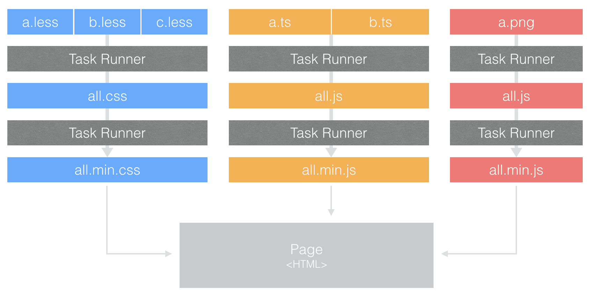

# 构建工具发展与背景

## 背景
近10年前端发展太过迅速，自从v8与node.js的诞生开始，前端的职责渐渐从页面模式（原来的简单的页面效果、交互效果）开始向webapp的方向发展。为了解决某类问题，越来越多的前端插件、库、框架如雨后春笋般在前端社区开始生长，然而，由于依赖的模块越来越多，管理、测试、发布上线成为一系列炒鸡麻烦的事情，因此，前端的自动化构建工具应运而生。

## Grunt 与 Gulp
Grunt 主张配置思想来打包脚本，在wrapper函数里配置任务，在grunt.initConfig注入任务配置，调用grunt执行，grunt支持子任务，可以在父任务里定义子任务，执行指定地子任务。Grunt 采用串行方式执行任务，按照任务名称地顺序形式，但是任务与任务之间没有通信桥梁，导致IO调用频繁。再就是随着项目地规模逐步增大，任务也会增多，在大量任务地情况下，试图用配置完成，这简直是disaster。

Gulp 主张代码方式由于配置的思想，用过代码配置任务，代码采用流式地写法，写法较grunt简单灵活，官方抽象出src，pipe，dest，watch接口，入门相当简单，代码量远远少于编写grunt地代码量。同时在打包脚本上，gulp使用all in one 的打包方式，利用了node流的优势，减少IO的调用次数，使得打包速度比grunt快上好几倍。

然而，gulp本身并没有模块化的概念，如果要在gulp上使用模块化，只能通过集成第三方模块化框架（require.js，seajs），同时grunt 和 gulp两者集成度不高，通常一个项目下来，要写不少的配置才能满足需求，这样一来，根本无法做到开箱即用。

## Webpack
官方对webpack的定义是：“JavaScript 应用程序的静态模块打包器(module bundler)”。Webpack支持common.js模块化，且主张一切皆是模块的思想，当webpack处理应用程序的时候，会递归文件的引用，分析依赖关系，递归生成依赖关系图，其中包含应用程序需要的每个模块，然后将这些模块打包成一个或者多个bundle。

同时Webpack 与 Grunt类似基于配置的构建方式，属于高度可配置化的，与 Grunt 不同的是，它包含的许多自动化的黑盒操作所以配置起来会简单很多。时至今日，随着Webpack生态圈的建立，Webpack能做的事不只是模块打包器而已，以Webpack为核心的前端工程化的思想已经流行起来，这个项目工程化的生成工具，叫做 “脚手架”。