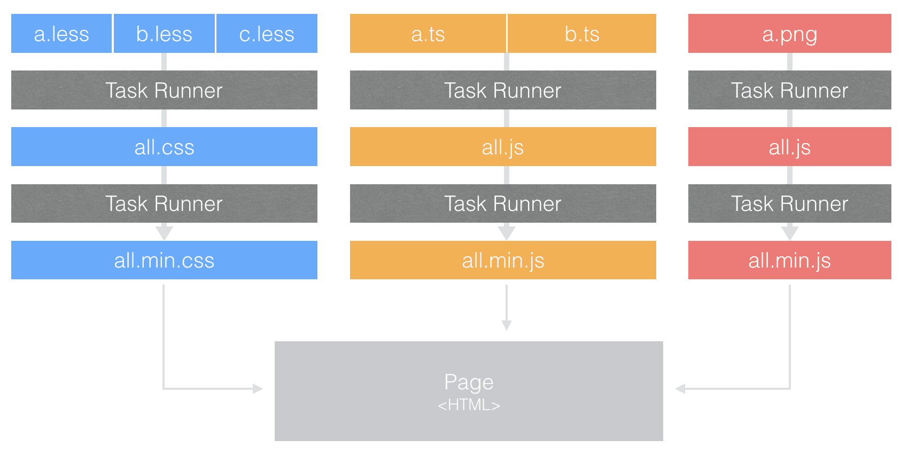

# Grunt 与 Gulp
## Grunt
Grunt 主张配置思想来打包脚本，在wrapper函数里配置任务，在grunt.initConfig注入任务配置，调用grunt执行，grunt支持子任务，可以在父任务里定义子任务，执行指定地子任务。Grunt 采用串行方式执行任务，按照任务名称地顺序形式，但是任务与任务之间没有通信桥梁，导致IO调用频繁。再就是随着项目地规模逐步增大，任务也会增多，在大量任务地情况下，试图用配置完成，这简直是disaster。

## Gulp
Gulp 主张代码方式由于配置的思想，用过代码配置任务，代码采用流式地写法，写法较grunt简单灵活，官方抽象出src，pipe，dest，watch接口，入门相当简单，代码量远远少于编写grunt地代码量。同时在打包脚本上，gulp使用all in one 的打包方式，利用了node流的优势，减少IO的调用次数，使得打包速度比grunt快上好几倍。

然而，gulp本身并没有模块化的概念，如果要在gulp上使用模块化，只能通过集成第三方模块化框架（require.js，seajs），同时grunt 和 gulp两者集成度不高，通常一个项目下来，要写不少的配置才能满足需求，这样一来，会无限增加开发周期。